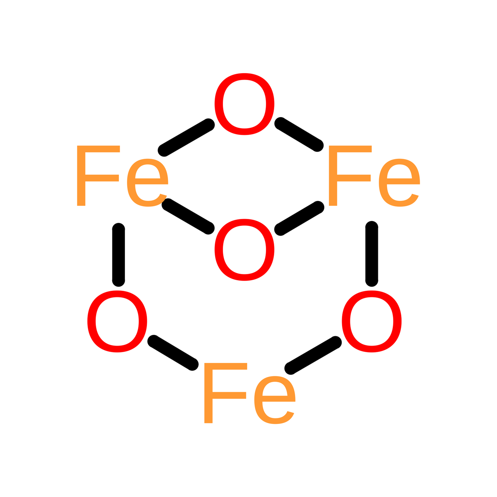

<p align="center">
  
</p>

<h1 align="center">Oxide</h1>

<p align="center"><strong>Build formally verified Rust programs with highly concurrent agent swarms.</strong></p>

## How it works

Oxide is a meta-harness for coordinating Codex agents in parallel. It compiles
natural-language specifications into executable contracts for implementation,
review, and formal verification.

```text
 specification
              |
              v
 planning agent <-------- user feedback
              |
              v
 approved ROADMAP.md
              |
              v
 contract agent <-------- user feedback
        |     |
        |     +---- ambiguity or gap ----> approved source/roadmap revision
        |                                      |
        +--------------------------------------+
              |
              v
 multi-phase contract + exact semantic trace
              |
              v
 embedded attestation + user approval; mechanical qualification
              |
              v
 +-----------------------------------------------------------+
 |                 shared append-only journal                |
 | ready work | atomic claims | candidates | proof evidence  |
 +--------+----------------+----------------+----------------+
          |                |                |
        claim            claim            claim
          |                |                |
 +--------v-------+ +------v---------+ +----v-------------+
 | worker A       | | worker B       | | worker C         |
 | implements API | | reviews code   | | runs exact check |
 +--------+-------+ +------+---------+ +----+-------------+
          \                |                /
           \_______________|_______________/
                           |
                           v
               exact prospective-tree gate
                           |
                           v
                         merge
                           |
                           v
                  newly unblocked work
```

1. Run `./oxide harness plan` to turn a specification into an approved roadmap.
2. Run `./oxide harness generate-contract`, check one or more ready phases, and
   generate one executable contract. Dependencies must be checked first.
3. Approve the generated contract after the agent attests it and Oxide
   mechanically qualifies it.
4. Run `./oxide harness run` to start Codex workers. They claim implementation,
   review, and verification work from the shared journal and run in parallel.
5. Oxide merges each candidate after its reviews, checks, and whole-tree proof
   pass, then assigns the work that merge unlocks.

## Verification philosophy

Oxide uses [Verus](https://verus-lang.github.io/verus/guide/) to prove that Rust
code satisfies its formal contracts. Its normative
[verification policy](https://github.com/textembedding/oxide/blob/main/docs/VERIFICATION_PRIMER.md)
applies to every target independently of its product specifications.

Every production logical component belongs to one refinement chain:

```text
 observable product behavior
              |
              v
     abstract state machine
              |
              v
 meaningful component contracts
              |
              v
 production Rust + Verus proofs <--- declared assumptions
              |                          from narrow,
              v                          policy-free
 whole-program composition proof         effect adapters
              |
              v
 exact prospective-tree proof
              |
              v
     formal correctness gate ---------+
                                       +--> release-ready tree
     empirical capacity gate --------+
        (benchmarks and faults)
```

- All production logic is Verus-verified by default. There is no “typed but
  unverified” or low-risk exemption.
- Uniform coverage does not mean uniform proof size. Simple, meaningful contracts
  may be discharged automatically; complex protocols may need substantial proof.
- Trusted effect adapters are narrow, explicit, and contain no journal policy.
- Deterministic policy checks reject vacuous contracts, undeclared assumptions,
  source/proof divergence, and attempts to redefine the judge.
- Agent review supplements proof; it cannot replace Verus or deterministic policy.
- Formal correctness and empirical capacity are separate gates.

## Target project

A Rust project using Oxide keeps its verification inputs under `verification/`;
it does not need an Oxide-specific directory:

```text
my-rust-product/
├── docs/
│   └── specs/
├── ROADMAP.md
├── src/ or crates/
└── verification/
    ├── contract.toml
    ├── manifest.toml
    ├── toolchain.lock.toml
    ├── contracts/
    ├── models/
    ├── proofs/
    ├── fixtures/
    └── fuzz/
```

`verification/contract.toml` identifies the immutable specification and toolchain
closure, classifies production and proof roots, defines an acyclic implementation
graph, and assigns formal or supplementary checks to coherent candidates. Oxide
constructs formal Verus commands itself, so a candidate cannot redefine the judge
that accepts it.

`contract.toml` also binds the contract agent's attestation and the user's exact
approval. Oxide recomputes mechanical qualification at admission instead of
trusting a stored qualification claim. Specifications remain authoritative for
product behavior, `ROADMAP.md` is the approved staged plan, and the contract is
their enforceable derivation.

Source traceability is strict about meaning, not Markdown styling. Rewording,
punctuation, links, and code invalidate a binding; line wrapping, indentation,
list markers, and emphasis do not force a contract rewrite.

`manifest.toml` remains separate because it is not a pre-contract approval file.
It is the evolving coverage map from production Rust components to contracts,
models, proofs, and the trusted boundary. Workers update it with the code; the
exact prospective-tree gate validates it before merge.

At run creation, Oxide freezes the target commit, contract and immutable closure,
verification-engine digest, execution policy, journal capacity, qualification
receipt, and Git identity. Changing the specification, toolchain, contract, or
judge starts a new run.

## The journal backend

The shared journal backend makes parallel execution safe. Claims, candidates,
check evidence, reviews, merges, and recovery form one durable chronological
history. Atomic claims select one owner per assignment, while deterministic replay
lets every worker recover the same state without a privileged orchestrator.

Workers see one append-only journal through exactly two operations:

- `journal_add` appends records and atomically arbitrates competing claims.
- bounded `journal_search` returns exact and threshold-eligible semantic context
  in chronological order.

The Python prototype dogfoods the planned production Exact and lexical indexes.
Both are generic, rebuildable projections of immutable records; neither knows
about Oxide tasks or changes the two-operation interface.

Workflow meaning remains above this generic two-operation interface. The bundled
Python backend is the current prototype; it can be replaced by a Rust backend only
after that backend passes the same black-box conformance and multiprocess
qualification suites.

Each launcher generation performs one indexed recovery, then shares that warm,
journal-derived projection with every worker and observer on the host. Fresh agent
contexts therefore recover their assignment without replaying the full run.

## Install and verify Oxide

1. Install the development dependencies and verify the checkout:

```bash
uv sync --extra dev
./oxide verify
```

`./oxide` automatically uses the local `.venv`; no global install is required.

Prompt evaluation and bounded GEPA optimization live in
[`eval/`](eval/README.md). They score source fidelity and adversarial robustness
without prescribing one gold roadmap.

2. Plan the project:

```bash
./oxide harness plan --target /path/to/my-rust-product/docs/specs/
```

The planning agent reads all specifications and revises a standardized
`ROADMAP.md` with you. Enter `/approve` to write it. The roadmap may include
`planned`, `deferred`, or `blocked` phases, but only a `ready` phase can become a
contract.

3. To maintain an approved phase, run:

```bash
./oxide harness plan \
  --target /path/to/my-rust-product/docs/specs/ \
  --update stage-1
```

Maintenance mode preserves unselected phases and stable IDs, previews the diff
and approval impact, and writes only after `/approve`. Use it for readiness,
dependencies, or allocating existing requirements. Edit the specification first
when behavior or success semantics change. Repeat `--update` for each phase in a
coordinated multi-phase change. Readiness-only updates preserve dependent
approvals; semantic changes invalidate affected approvals.

4. Select ready phases and generate their contract:

```bash
./oxide harness generate-contract /path/to/my-rust-product/ROADMAP.md
```

The selector enables a phase only when it is ready and all of its dependencies
are checked. Confirm the checked set to start the contract agent. It resolves the
cited requirements and invariants, then revises the tasks and verification goals
with you. Enter `/approve` to write one `verification/contract.toml` containing
the exact trace, attestation, and approval. Commit it before execution.

5. Qualify the journal backend, then launch against the committed target:

```bash
./oxide harness validate-concurrency --workers 8 --rounds 6
./oxide harness run \
  --target /path/to/my-rust-product \
  --workers 8
```

`run` uses `verification/contract.toml` by default and supports up to 64 workers;
the contract graph determines how many can work productively. Planning and
contract generation never start runtime processes. Launch fails before creating
run state if its approval, attestation, recomputed qualification, trace, or phase
binding is missing or stale.

## Observe and control

```bash
./oxide harness observe --workload verified-map --slot worker-0
./oxide harness observe-queue --workload verified-map
./oxide harness status --workload verified-map

./oxide harness pause --workload verified-map
./oxide harness resume --workload verified-map
./oxide harness checkpoint --workload verified-map --name productive
./oxide harness rewind --workload verified-map --to productive
./oxide harness reset --workload verified-map
```

Runtime databases, logs, evidence, worker clones, and sockets remain under the
ignored `.oxide/` directory. Product files remain in the target project.

The normative system boundaries and acceptance invariants are in
[docs/ARCHITECTURE.md](docs/ARCHITECTURE.md). Oxide's universal assurance rules
and their rationale are in the normative
[verification policy](docs/VERIFICATION_PRIMER.md).
